# Panduan Storyboard & Script Video Demo VibeDesk (3 Menit / 180 Detik)

Dokumen ini berisi panduan alur perekaman video simulasi demo web **VibeDesk** berdurasi **3 menit** untuk syarat perlombaan **#JuaraVibeCoding**, lengkap dengan petunjuk visual, teks narasi (Voiceover), dan subtitle dalam bahasa Indonesia.

---

## Ringkasan Alur Video (Timeline 3 Menit)

```mermaid
gantt
    title Alur Video Demo VibeDesk (3 Menit)
    dateFormat  X
    axisFormat %s
    section Alur Utama
    1. Pembukaan & Latar Belakang Masalah  :active, 0, 20
    2. Eksplorasi Landing Page Dinamis    : 20, 50
    3. Autentikasi & Login Portal         : 50, 80
    4. Pengelolaan Tiket & Dashboard SLA  : 80, 120
    5. Fitur Landing Manager & SweetAlert2: 120, 150
    6. Sinkronisasi Kontak & Cloud SQL (MySQL) : 150, 170
    7. Penutup & Ajakan Aksi               : 170, 180
```

---

## Rincian Adegan (Scene-by-Scene Script)

### Adegan 1: Pembukaan & Latar Belakang Masalah
* **Durasi**: `00:00 - 00:20` (20 detik)
* **Petunjuk Visual**: 
  * Rekam halaman utama/landing page VibeDesk dari atas.
  * Arahkan kursor pada logo dan teks utama VibeDesk.
* **Narasi / Voiceover**: 
  * *"Halo semua! Dalam industri bisnis digital, kepuasan pelanggan ditentukan oleh seberapa cepat tim dukungan Anda merespon kendala. Keterlambatan respon tiket dan kegagalan memantau SLA sering kali menjadi masalah utama. Memperkenalkan VibeDesk—solusi cerdas sistem ticketing dan manajemen SLA modern."*
* **Subtitle**:
  > **VibeDesk: Solusi Cerdas Manajemen SLA & Sistem Tiket Modern.**

---

### Adegan 2: Eksplorasi Landing Page Dinamis
* **Durasi**: `00:20 - 00:50` (30 detik)
* **Petunjuk Visual**:
  * Tunjukkan efek perubahan kata dinamis (Text Rotator) pada teks hero: *"Sistem Tiket"*, *"Manajemen SLA"*, *"Kolaborasi Tim"*.
  * Scroll perlahan ke bawah memperlihatkan fitur-fitur unggulan, bagian *"About Us"* dinamis, statistik pencapaian, dan footer *"Powered by VibeDesk"*.
* **Narasi / Voiceover**:
  * *"VibeDesk hadir dengan antarmuka yang bersih, responsif, dan interaktif dengan kombinasi warna premium. Halaman utama kami dirancang secara dinamis agar perusahaan dapat menyajikan info produk, statistik, serta visi-misi terbaru kepada publik."*
* **Subtitle**:
  > **Tampilan Premium & Responsif Dilengkapi Statistik Real-time.**

---

### Adegan 3: Autentikasi & Login Portal
* **Durasi**: `00:50 - 01:20` (30 detik)
* **Petunjuk Visual**:
  * Klik tombol **"Login Portal"** di kanan atas.
  * Tunjukkan halaman login yang elegan dengan popover bantuan kredensial.
  * Gunakan akun demo bawaan (`admin@fitrahpro.com` / `FitrahPro@2026`) untuk masuk dan klik **"Sign In"**.
* **Narasi / Voiceover**:
  * *"Portal masuk didukung oleh token session handling yang aman untuk memastikan hanya staf berwenang yang dapat mengelola data internal. Cukup sekali klik, administrator dapat masuk ke sistem."*
* **Subtitle**:
  > **Keamanan Terjamin dengan Token-based Session Authentication.**

---

### Adegan 4: Pengelolaan Tiket & Dashboard SLA
* **Durasi**: `01:20 - 02:00` (40 detik)
* **Petunjuk Visual**:
  * Tampilkan halaman Dashboard utama berisi grafik performa dan statistika tiket (Open, In Progress, Resolved).
  * Klik menu **"Tickets"**, lalu klik **"Create Ticket"** (buat tiket baru) atau klik salah satu detail tiket untuk melihat riwayat aktivitas dan kolom komentar internal/eksternal.
  * Klik menu **"Team"** untuk memperlihatkan manajemen CRUD anggota tim staf pendukung.
* **Narasi / Voiceover**:
  * *"Di dalam dasbor, Anda disuguhkan grafik analitik performa SLA yang interaktif. Manajer dapat memantau status tiket, mengalokasikannya ke agen yang tepat, menambahkan anggota tim pendukung baru, dan berkolaborasi langsung melalui log riwayat tiket."*
* **Subtitle**:
  > **Dashboard Analitik SLA Terpadu, Riwayat Tiket, & CRUD Anggota Tim.**

---

### Adegan 5: Fitur Landing Manager & SweetAlert2
* **Durasi**: `02:00 - 02:30` (30 detik)
* **Petunjuk Visual**:
  * Klik menu **"Landing Manager"** di sidebar.
  * Klik tombol edit pada Hero Section, lakukan perubahan teks kecil (misal: deskripsi subjudul).
  * Klik **"Save Changes"**.
  * Tunjukkan notifikasi SweetAlert2 sukses yang muncul di tengah layar dengan animasi modern.
* **Narasi / Voiceover**:
  * *"Tidak perlu lagi mengedit kode sumber untuk mengganti teks promo. VibeDesk menyediakan fitur Landing Manager terintegrasi dengan validasi notifikasi SweetAlert2 yang modern untuk merubah konten situs secara instan."*
* **Subtitle**:
  > **Landing Manager Praktis dengan Notifikasi Sukses SweetAlert2.**

---

### Adegan 6: Sinkronisasi Kontak & Cloud SQL
* **Durasi**: `02:30 - 02:50` (20 detik)
* **Petunjuk Visual**:
  * Klik menu **"Settings"** di sidebar.
  * Ubah email kontak menjadi alamat baru, lalu klik **"Save Settings"**.
  * Buka tab Landing Page utama dan perlihatkan kontak card di bagian bawah (Email, Telepon, Alamat) otomatis terupdate secara dinamis sesuai perubahan tadi.
* **Narasi / Voiceover**:
  * *"Semua pengaturan umum kontak disinkronisasikan secara dinamis dan disimpan secara permanen menggunakan database relasional Google Cloud SQL dengan Prisma ORM, sehingga terjamin performa tingkat enterprise dan aman dari risiko kehilangan data."*
* **Subtitle**:
  > **Cloud SQL & Prisma ORM Handal, Menjaga Sinkronisasi Data secara Permanen.**

---

### Adegan 7: Penutup & Ajakan Aksi
* **Durasi**: `02:50 - 03:00` (10 detik)
* **Petunjuk Visual**:
  * Kembali ke landing page utama, arahkan ke tombol **"Mulai Sekarang"** yang berkilau.
* **Narasi / Voiceover**:
  * *"Mari tingkatkan produktivitas tim Anda dan jaga standar kepuasan pelanggan sekarang juga bersama VibeDesk! Terima kasih."*
* **Subtitle**:
  > **Optimalkan Standar Operasional & SLA Bisnis Anda bersama VibeDesk!**
